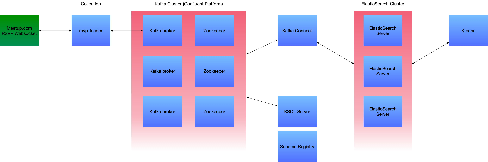

# Pinkstack RSVP Experiment

High-level system diagram of pinkstack-rsvp.




## Pinkstack RSVP Feeder

[![rsvp-feeder-shield][rsvp-feeder-shield]][rsvp-feeder-docker-hub]

Purpose of this service is to connect to [Meetup.com RSVPs WebSocket][meetup-com-rsvp-ws] and pipe the data to a Kafka topic. 
The feeding is being done with a AVRO backed schema using Kafka's Schema Registry.

The service needs the following environment variables

```bash
SCHEMA_REGISTRY_URL=http://schema-registry:8081
BOOTSTRAP_SERVERS=kafka-broker-server:9092
RSVP_TOPIC=rsvps # Topic for RSVPs
KAMON_AMP_API_KEY="kamon amp key"
```

The service can be build from this repository via following `sbt` invocation. 
This will pull all dependencies, compile everything, run tests and package the `FeederApp` into 
Docker image `pinkstack/rsvp-feeder` with tags `[0.1.0-SNAPSHOT, latest, local]`

```bash
sbt dockerize
```

To build and push the rsvp-feeder image into Docker Hub use the combination of `dockerize` and `tagPushFeederApp`. 
This will create the image and tag it with 6 letters "tag" so that it can be used in something like Kubernetes or HELM. 
Custom task `tagPushFeederApp` invokes [`tag-push-feeder-app.sh`](bin/tag-push-feeder-app.sh) BASH shell script.

```bash
sbt "doockerize;tagPushFeederApp"
```

### Deployment with `skaffold`

```bash
sbt dockerize && skaffold run --tail=true
```

### Deployment with `kubectl`

```bash
sbt dockerize && kubectl apply -f kubernetes/rsvp-deployment.yaml
```

## KSQL Experiments

```bash
ksql http://localhost:8088
```

Creating a `hot_rsvps` stream out of `rsvps` Kafka topic

```SQL
CREATE STREAM hot_rsvps WITH(
    kafka_topic='rsvps', 
    value_format='AVRO', 
    KEY='rsvp_id', 
    TIMESTAMP='mtime');

CREATE STREAM live_rsvps WITH(
    kafka_topic='rsvps', 
    value_format='JSON', 
    KEY='rsvp_id', 
    TIMESTAMP='mtime');

DESCRIBE hot_rsvps;
```

Experimenting with aggregation and KSQL tables.

```SQL
CREATE TABLE TOP_EVENTS AS
    SELECT  event->event_id AS event_id, 
            event->event_name AS event_name,
            COUNT(*) as u_count 
    FROM hot_rsvps 
    WINDOW 
        TUMBLING (SIZE 5 MINUTES) 
    GROUP BY event->event_id,
        event->event_name
    HAVING COUNT(*) > 1
    EMIT CHANGES;
```

Stream with flattened location for compliance with [ElasticSearch Geo-point datatype](https://www.elastic.co/guide/en/elasticsearch/reference/current/geo-point.html).

```SQL
CREATE STREAM rsvps_formatted WITH (VALUE_FORMAT='JSON') AS
SELECT 
  `MEMBER`->member_id as member_id,
  `MEMBER`->member_name as member_name,
  `GROUP`->group_name as group_name,
  `GROUP`->group_id as group_id,
  (CAST(`GROUP`->group_lat AS STRING) + ',' + CAST(`GROUP`->group_lon AS STRING)) as group_location,
  `GROUP`->group_city as group_city,
  `GROUP`->group_country as group_country,
  `GROUP`->group_state as group_state,
  `GROUP`->group_urlname as group_urlname,
  `EVENT`->event_id AS event_id,
  `EVENT`->event_name AS event_name,
  TIMESTAMPTOSTRING(`EVENT`->time, 'yyyy-MM-dd HH:mm:ss.SSS') as event_time,
  `EVENT`->event_url AS event_url,
  visibility,
  guests,
  TIMESTAMPTOSTRING(mtime, 'yyyy-MM-dd HH:mm:ss.SSS') AS timestring
FROM rsvps_stream
EMIT CHANGES;
```

## Confluent Connector Definition

```JSON
{
  "name" : "rsvps-to-es",
  "config" : {
    "connector.class" : "io.confluent.connect.elasticsearch.ElasticsearchSinkConnector",
    "key.converter" : "org.apache.kafka.connect.storage.StringConverter",
    "value.converter" : "org.apache.kafka.connect.json.JsonConverter",
    "topics" : "RSVPS_FORMATTED",
    "errors.log.enable" : "true",
    "errors.deadletterqueue.topic.replication.factor" : "1",
    "connection.url" : "http://elasticsearch-master:9200",
    "type.name" : "rsvps_formatted",
    "key.ignore" : "true",
    "schema.ignore" : "true",
    "value.converter.schema.registry.url" : "http://one-cp-schema-registry:8081",
    "value.converter.schemas.enable" : "false",
    "key.converter.schema.registry.url" : "http://one-cp-schema-registry:8081"
  }
}

```

## HELM & K8

```bash
# Confluent platform w/ Kafka
helm repo add confluentinc https://confluentinc.github.io/cp-helm-charts/
helm install one confluentinc/cp-helm-charts --atomic -f charts/kafka-values.yaml

# Elastic search
helm repo add elastic https://helm.elastic.co
helm install es elastic/elasticsearch -f charts/elasticsearch-values.yaml --atomic


# Kibana
helm install kib elastic/kibana -f charts/kibana-values.yaml --atomic
```

## Tools

- [kubefwd](https://github.com/txn2/kubefwd)

## Resources

- [Meetup.com - Long-Polling RSVP Stream](https://www.meetup.com/meetup_api/docs/stream/2/rsvps/)

## Author

- [Oto Brglez](https://github.com/otobrglez)

[rsvp-feeder-docker-hub]: https://hub.docker.com/r/pinkstack/rsvp-feeder
[rsvp-feeder-shield]: https://img.shields.io/docker/pulls/pinkstack/rsvp-feeder
[meetup-com-rsvp-ws]: http://meetup.github.io/stream/rsvpTicker/
